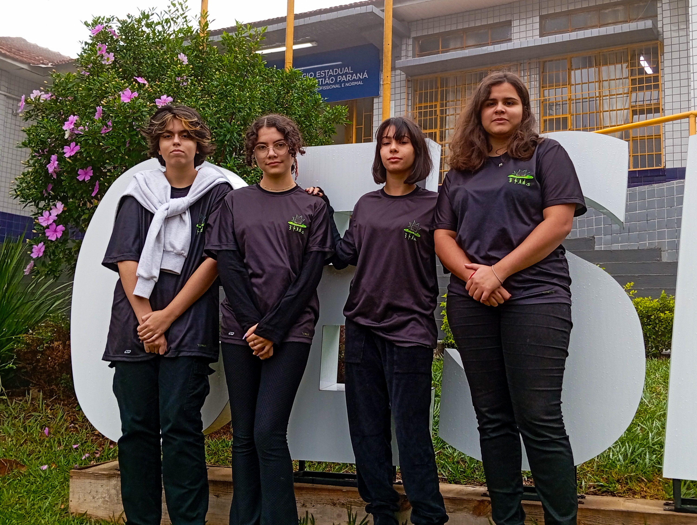
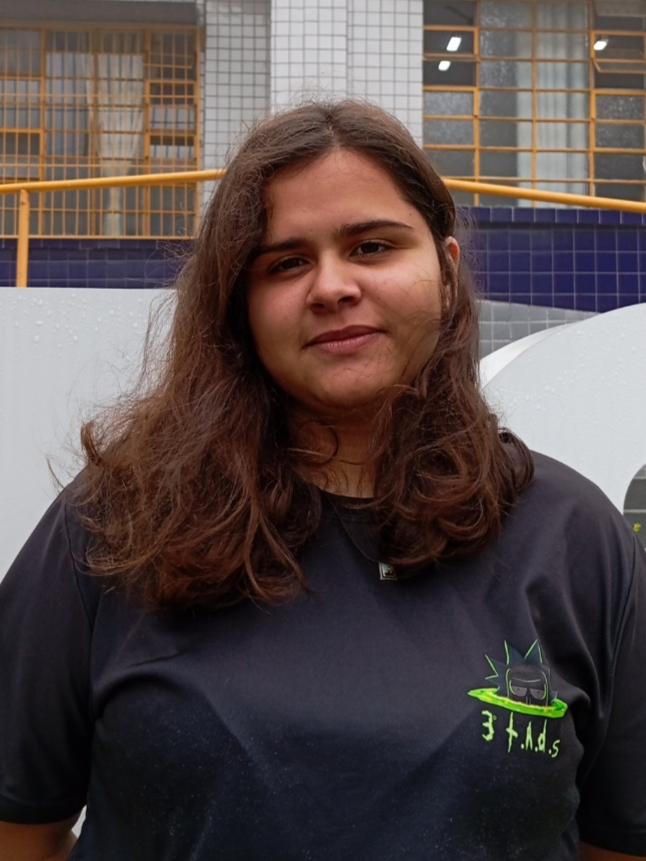
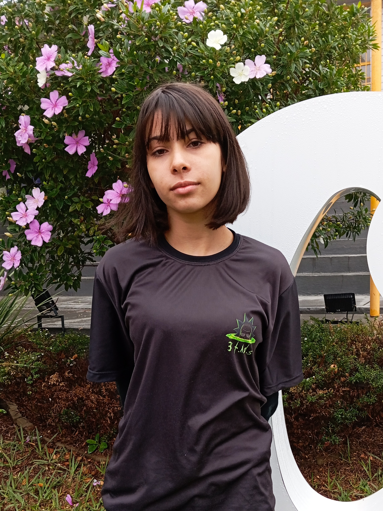
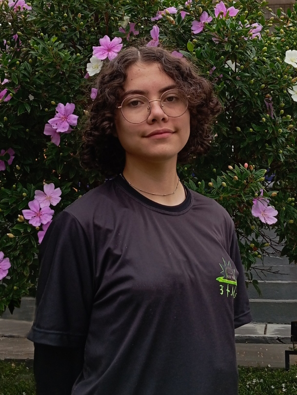
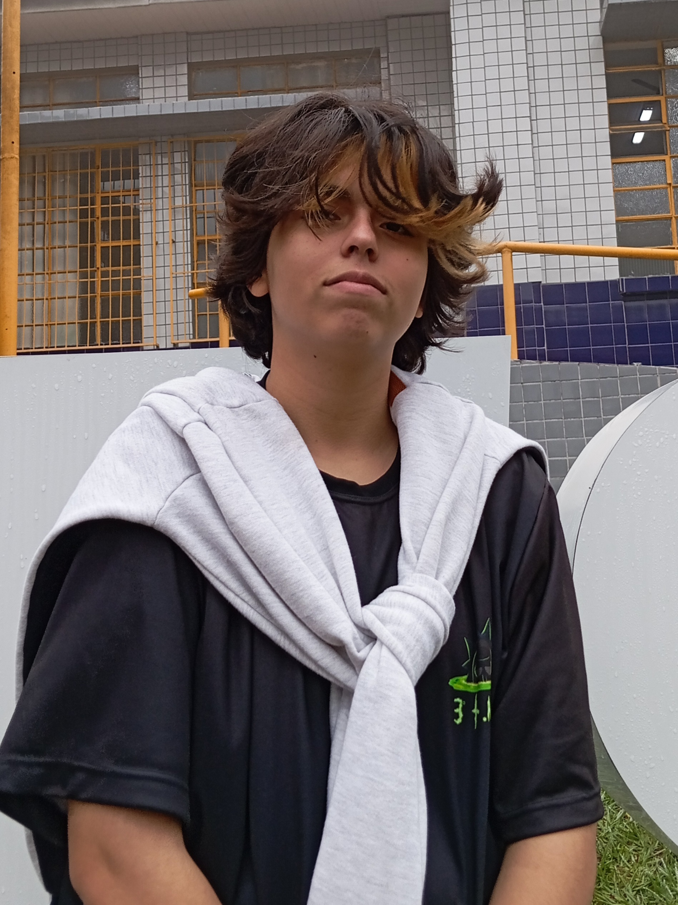

um# Projeto FominhaApp

FominhaApp é um projeto que busca diminuir o disperdicio de alimentos na escola através da votação da intenção dos alunos diante da merenda.

# Etapas

O projeto ainda está em desenvolvimento e as próximas atualizações serão voltadas nas seguintes tarefas:

- [x] Desenvolvimento do Aplicativo.
- [x] Criação da logo.
- [x] Criação das redes sociais.
- [x] Primeiro contato com os alunos na escola piloto.
- [ ] Apresentaçao da equipe e divulgação do nome.
 

# 💻 Harvest

Harvest significa colheita, e evoca a ideia do uso eficiente de recursos.
> 
> Heroes
> 
> Against
> 
> Resource
> 
> Waste
> 
> Enabling
> 
> Sustainable
> 
> Transformation

"Heróis contra o desperdício de recursos, permitindo a transformação sustentável "

# Equipe Harvest 

Apresentação da equipe:

<table>
  <tr>
    <td align="center">
      <a href="#" title="defina o titulo do link">
         
        
          <b>Graziela Santos</b>  
         <b> Progamadora Front-End </b>
        
      </a>
    </td>
   <td align="center">
      <a href="#" title="defina o titulo do link">
         
        
          <b>Geovana Domingos</b>  
          <b> Criadora de conteúdos e administração. </b> 
        
      </a>
    </td>
    <td align="center">
      <a href="#" title="defina o titulo do link">
         
        
          <b> Kheronn Machado</b>  
          <b> Orientador </b>
        
      </a>
    </td>
    <td align="center">
      <a href="#" title="defina o titulo do link">
         
        
          <b>Maria Vitória</b>  
          <b>Social Mídeas </b>
        
      </a>
    </td>
   <td align="center">
      <a href="#" title="defina o titulo do link">
         
        
          <b>Maria Clara</b>  
          <b>Designer </b>
        
      </a>
    </td>
  </tr>
</table>
